## State of the Art  
**Project:** *Catalan Music Classification and Analysis*  
**Version 2**  
**Contributors:** Adrià Cortés Cugat, Martí Armengol Ayala, Sergi De Vicente, Guillem Garcia, Jofre Geli, Javier Echávarri, Alex Salas Molina  
**Course:** Music Technology  

---

### Introduction  
This document presents the state of the art for the project **“Catalan Music Classification and Analysis”** developed in the context of the Music Technology course. The project explores the use of machine learning and audio analysis techniques to classify and interpret stylistic characteristics of Catalan music across different bands and time periods. 

The state of the art covers relevant academic literature, technological tools, and applications that support the methodology of the project. The focus is on understanding existing research in the fields of **music classification, audio embeddings, and unsupervised learning**, as well as identifying the most suitable tools and models to implement a robust classification and analysis pipeline.

The document is structured into five sections:
1. Literature overview of music classification and MIR
2. Technologies used in the project (CLAP, PCA, KNN, etc.)
3. Real-world tools and applications
4. Reference list of all supporting works

## 1. Literature Review

Music classification and content-based analysis have been active areas of research within both music information retrieval (MIR) and machine learning. The growing availability of large audio datasets and advances in deep learning have made it possible to extract meaningful embeddings from music and use them for clustering, recommendation, and genre or mood classification.

A significant portion of the literature focuses on **feature-based classification**, where characteristics such as **timbre, rhythm, melody, tempo, and instrumentation** are used to distinguish between musical styles or genres. **Tzanetakis and Cook (2002)** were pioneers in this area, introducing a genre classification system based on spectral and rhythmic features, which remains a foundational reference in MIR.

Recent research has shifted towards **embedding based methods**, where pretrained models transform audio into high-dimensional vectors that encode musical properties. Papers such as **Gong et al. (2022) on CLAP** (Contrastive Language-Audio Pre-training) and **Kreuk et al. (2022)** on audio-language models illustrate how joint embeddings of sound and text enable tasks like zero-shot classification, semantic search, and music similarity analysis. These models are especially relevant to our project, as we plan to use CLAP to embed songs and explore their relationships.

In addition to classification, **unsupervised learning techniques** like **K-Means clustering** and **dimensionality reduction methods** (PCA, t-SNE, UMAP) are widely applied in music research to analyze similarities between songs and uncover latent patterns. These methods have been used in projects such as **Spotify’s MusicMap** and other genre visualization tools to provide intuitive interfaces for music exploration.

Furthermore, the use of similarity metrics in MIR has been deeply studied. **Casey et al. (2008)** discuss various distance functions and their application in MIR systems. Metrics such as **cosine similarity and Euclidean distance** are essential when working with **embeddings**.

Among the classical machine learning approaches for music classification, **K-Nearest Neighbors (KNN)** has been widely adopted due to its simplicity and interpretability. Several studies have shown that combining KNN with handcrafted features such as **Mel-Frequency Cepstral Coefficients (MFCCs)** yields reasonable classification performance, particularly for genre recognition tasks. However, KNN-based systems often face difficulties when genres exhibit significant overlap in their acoustic characteristics—such as rock and country—limiting their discriminative power in complex scenarios.

To address computational scalability and improve classification pipelines, some approaches leverage **K-Means clustering** in combination with KNN. In this hybrid setup, K-Means is first used to identify centroids representing clusters of similar songs based on selected features, and then KNN operates on these centroids rather than on the entire dataset. This method reduces computational cost, although it may sometimes lead to a trade-off between efficiency and accuracy.

Beyond its role in supporting classification tasks, **K-Means clustering** has been extensively employed as an unsupervised technique for grouping songs according to their audio features. Common features used in these clustering applications include **tempo, timbre, spectral descriptors, and rhythm-related attributes**. Clustering facilitates the organization of music libraries and enhances recommendation systems by uncovering latent song groupings that reflect stylistic or perceptual similarities. An illustrative example is the classification of **protest songs** using K-Means on both conceptual and descriptive audio features, demonstrating the method’s flexibility across different music analysis contexts.

## 2. Technology Review

This section reviews the main technologies and tools related to our project for the classification and analysis of Catalan songs. Our approach combines recent advances in audio embedding models, unsupervised machine learning, dimensionality reduction, and recommendation systems to analyze musical characteristics across bands and time periods. The selected technologies allow us to extract meaningful audio features, represent songs in a high-dimensional space, identify clusters, and visualize patterns.

### 2.1 CLIP & CLAP  
#### 2.1.1 Contrastive Language-Image Pre-training (CLIP)
Neural Network developed by OpenAI whose function is to learn and understand the connections between images and text descriptions that are used for them. CLIP learns to pair photos with words that describe them correctly.
It is a multimodal model, it works with two kinds of data, visual and text using two encoders. 
It also features a “zero-shot” classification which allows it to identify objects on images using text categories unseen on training. [9]

#### 2.1.2 Contrastive Language-Audio Pre-training (CLAP)
It is similar to clips but oriented to learning the connection between audio and text. It aims to learn the relationship between different sound types (music, speech, etc.) and the words we use for them. It allows tasks such as audio classification and audio recovery based on “zero shot” with no specific training for new categories. [10] [11]

  <table>
    <tr>
      <td>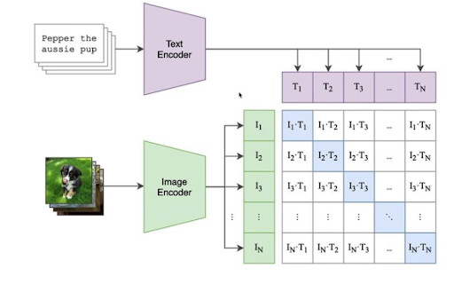</td>
      <td>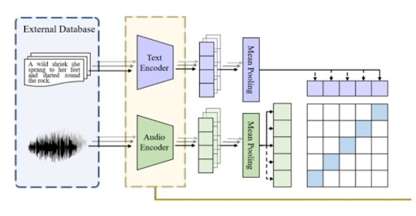</td>
    </tr>
  </table>

### 2.2 Recommender Systems and Similarity Metrics  
#### 2.2.1 Introduction to Recommender Systems
A recommender system is an information filtering approach designed to suggest relevant items to users based on various factors such as item characteristics, user preferences, or historical interactions. These systems are widely employed in areas like e-commerce, online streaming services, and social networks, where the primary goal is to enhance content discovery and personalize the user experience. [1] [2]

Although the focus of this project is not on building a conventional user-centric recommendation engine, the foundational ideas behind recommender systems—particularly the identification and suggestion of similar items—are directly applicable to our task. **In our case, the goal is to analyze the relationships between songs, bands, and time periods based on extracted audio features and learned embeddings**. Utilizing similarity metrics, a core component of content-based recommenders, allows us to better understand clustering structures and improve the interpretability of our visualizations.

#### 2.2.2 Types of Recommender Systems
Recommender systems are commonly classified into three main categories [1][3]:
- **Content-based filtering**: This approach generates recommendations by comparing the features of items. For our project, this translates to comparing song characteristics such as instrumentation, BPM, genre, and vocal attributes to identify similar songs.

- **Collaborative filtering**: This method relies on user-item interactions (e.g., ratings, likes, listening history) to recommend items. Since our project does not involve user data, this approach is not applicable.

- **Hybrid systems**: These systems combine content-based and collaborative techniques to improve recommendation quality. However, for the scope of this project, we focus exclusively on content-based filtering.

  <table>
    <tr>
      <td>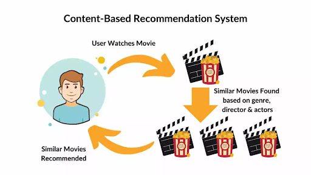</td>
      <td>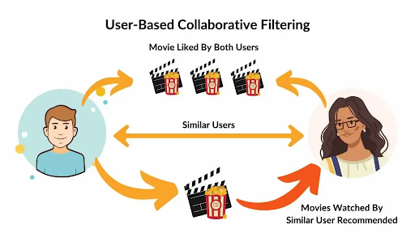</td>
    </tr>
  </table>

Given the nature of our task, **content-based recommendation techniques** are the most suitable, as they enable the comparison of songs directly through their feature vectors or embeddings without requiring user interaction data

#### 2.2.3 Similarity Metrics in Recommender Systems
Similarity metrics are central to content-based recommendation systems, as they quantitatively assess how similar two items are. In the context of our project, these metrics will also be fundamental for clustering evaluation and nearest neighbor approaches, supporting the classification and visualization of song relationships.

The most relevant similarity (or distance) metrics for this kind of task include [4] [5]:

- **Euclidean Distance**: Measures the straight-line distance between two feature vectors. It is commonly used in continuous spaces like BPM or embedding representations.  

  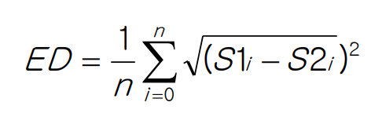

  
[12]

- **Cosine Similarity**: Computes the cosine of the angle between two vectors, focusing on their orientation rather than magnitude. This metric is particularly effective for high-dimensional embeddings, where the direction of the vector often carries more semantic meaning than its length.  

  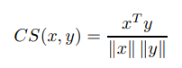

  
[13]

- **Manhattan Distance (L1 norm)**: Calculates the sum of the absolute differences between vector components. It is sometimes used as an alternative to Euclidean distance.  

  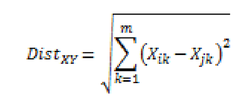

  
[14]

- **Jaccard Index**: Evaluates similarity between binary or categorical sets, though less relevant in our case where continuous embeddings are used.  

  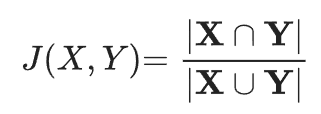

  
[15]

- **Pearson Correlation Coefficient**: Measures the linear relationship between two vectors, useful when evaluating the correlation between feature distributions.  

  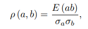

  
[16]

For our project, **cosine similarity and Euclidean distance will be the primary metrics employed, especially when working with pre-trained audio embeddings (e.g., CLAP or similar models)**. Cosine similarity is particularly suitable when the magnitude of vectors is less important than their orientation, which is often the case with embedding spaces.

#### 2.2.4 Application of Similarity Metrics in our Project
The integration of recommender system concepts and similarity metrics will contribute to several key aspects of our analysis:
- **Cluster Evaluation**: By applying similarity metrics, we can assess the cohesion of clusters formed through unsupervised learning methods such as KMeans, determining how close songs within the same cluster are to one another.

- **Visualization Support**: Similarity scores will help validate and explain patterns observed through dimensionality reduction techniques like PCA, UMAP, and t-SNE, providing insights into the relationships between different songs or bands.

- **Song Recommendation for Analysis**: Even though the project is not focused on user-oriented recommendations, similarity metrics can be used to identify and suggest songs that are most similar to a selected track within the dataset. This supports the exploration of song relationships and enhances the interpretability of the classification results.

In summary, recommender systems, especially content-based filtering methods and similarity metrics such as cosine similarity and Euclidean distance are key components in the analysis framework of this project. These tools will facilitate not only the evaluation of classification results but also the meaningful interpretation of the learned song embeddings, ultimately contributing to a deeper understanding of the stylistic and temporal relationships present in the Catalan music dataset.

  <table>
    <tr>
      <td>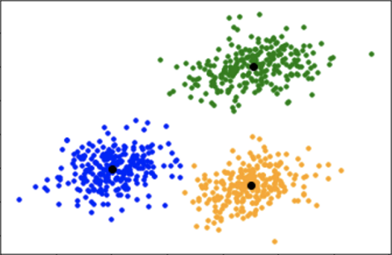</td>
      <td>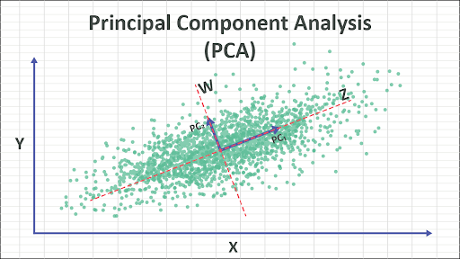</td>
    </tr>
  </table>

### 2.3 Version Control and Workflow Management (GitHub)

GitHub serves as the central platform for code management, collaboration, and documentation throughout the project. Maintaining a clean and reliable workflow is essential due to the experimental and data-driven aspect of this project. The repository is structured to support modular development, dataset versioning, and transparent experimentation.

#### 2.3.1 Application of Similarity Metrics in our Project
We use Git and GitHub to coordinate development across several branches: 
- **Main branch** holds the latest stable version of the codebase.
- **Feature branches** (e.g., feature/classifier, feature/visualization) are used for implementing specific components such as the classifier, data preprocessing scripts, and evaluation tools.
- **Pull requests** are used for code review, ensuring collaborative quality control and avoiding conflicts.

#### 2.3.2 Dataset Handling
Although the dataset is small (120 songs), it is manually split into two populations based on our criteria. Metadata files (metadata.csv) containing features such as genre, BPM, and vocal characteristics are stored in the repository, alongside scripts for feature extraction and preprocessing. If audio files are too large for GitHub, external hosting (Google Drive) is linked, and filenames are referenced through consistent IDs.

#### 2.3.3 Project Documentation
A detailed README.md outlines the project goals, setup instructions, and usage examples. Additional documentation includes:

- A docs/ folder with methodology notes and architecture diagrams.

- Issue tracking for bugs, enhancements, and research questions.

### 2.4 PCA, t-SNE, and UMAP  
In our project on the classification and analysis of Catalan music, we deal with high-dimensional audio features extracted from songs. To visualize and interpret these complex datasets effectively, we employ dimensionality reduction techniques such as Principal Component Analysis (PCA), t-Distributed Stochastic Neighbor Embedding (t-SNE), and Uniform Manifold Approximation and Projection (UMAP). These methods help in projecting high-dimensional data into lower-dimensional spaces, facilitating better understanding and visualization of the underlying structures and patterns.

#### 2.4.1 Principal Component Analysis (PCA)

  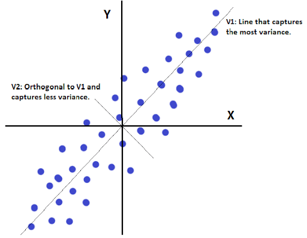
  

  PCA is a linear dimensionality reduction technique that transforms the original variables into a new set of uncorrelated variables called principal components. These components are ordered so that the first few retain most of the variation present in the original dataset. In the context of music analysis, PCA can help in reducing redundancy by transforming correlated musical features into a set of linearly uncorrelated variables, thereby simplifying the dataset without significant loss of information [6].
  

#### 2.4.2 t-Distributed Stochastic Neighbor Embedding (t-SNE)

  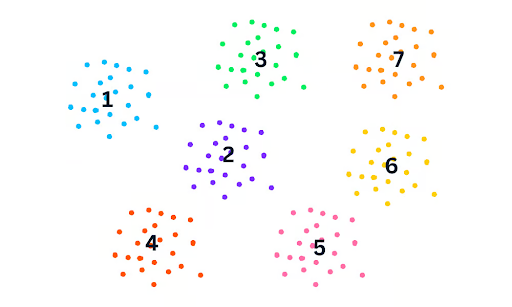
  

  t-SNE is a nonlinear dimensionality reduction technique particularly well-suited for embedding high-dimensional data into a space of two or three dimensions, which can then be visualized in a scatter plot. Unlike PCA, t-SNE focuses on preserving the local structure of the data, making it effective for revealing clusters or patterns in complex datasets [7].
  

  

  However, it is important to note that while t-SNE excels at capturing local neighborhood relationships, it does not preserve global distances well, which makes it more useful for visualization than for downstream machine learning tasks.
  

#### 2.4.3 Uniform Manifold Approximation and Projection (UMAP)

  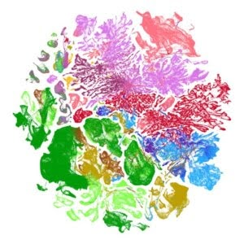
  

  UMAP is a more recent nonlinear dimensionality reduction technique that builds upon ideas from manifold learning and topological data analysis. Unlike t-SNE, UMAP aims to preserve both local and global structure in the data and tends to scale better to large datasets [8]. Its flexibility and performance make it particularly useful for applications involving complex audio embeddings, such as music analysis.
  

### 2.5 Feature Extraction  
In music classification and analysis tasks, the selection of relevant audio features is a crucial step for building effective models. Feature extraction techniques enable the transformation of raw audio signals into structured data representations that capture musical properties such as timbre, rhythm, pitch, and tempo. These features can then be used in both supervised and unsupervised learning pipelines.

#### 2.5.1 Feature Extraction Techniques
-**Mel-Frequency Cepstral Coefficients (MFCCs)**:
 MFCCs capture the **timbral characteristics** of audio signals by modeling the short-term power spectrum based on a nonlinear mel scale of frequency. Widely used in speech and music classification tasks, MFCCs have demonstrated solid performance in genre recognition and are often combined with machine learning algorithms like KNN.

- **Spectral Features**:
 This category includes descriptors such as **spectral centroid, spectral roll-off, spectral bandwidth, and spectral flux**, which provide insights into the **brightness, energy, and harmonic content** of the audio. Spectral centroid, for instance, represents the “center of mass” of the spectrum and is related to the perceived sharpness of the sound.

- **Tempo and Beats Per Minute (BPM)**:
 **Tempo-related features**, including BPM, are essential for distinguishing between musical styles, particularly when contrasting **electronic and acoustic** music or identifying rhythmic structures. These features can help cluster songs with similar rhythmic profiles.

#### 2.5.2 Tools and Libraries for Feature Extraction and Analysis
- **Librosa**:
 A widely used **Python library** for audio and music analysis that supports various feature extraction techniques, including **MFCCs, chroma features, spectral features, zero-crossing rate**, and more. Librosa also facilitates audio visualization and preprocessing tasks such as beat tracking and onset detection.

- **Scikit-learn**:
 A general-purpose machine learning library in Python offering implementations of classic algorithms such as **K-Nearest Neighbors (KNN)** and **K-Means clustering**, along with utilities for model evaluation, cross-validation, and dimensionality reduction. Scikit-learn integrates smoothly with feature extraction workflows for classification and clustering.

- **RStudio (and R packages)**:
 RStudio provides an environment for statistical computing and visualization. It supports clustering algorithms like **K-Means** and **K-Medoids**, with robust visualization capabilities for exploratory data analysis. R-based workflows can complement Python pipelines, especially for clustering validation and visual exploration of song groupings.

## 3. Applications Review

### 3.1 Spotify & MusicMap  
Spotify offers one of the most advanced commercial systems for audio classification and song recommendation. Through its **Audio Analysis API**, it provides detailed feature extraction, including tempo, key, energy, danceability, and valence. While Spotify’s system is not open source, its underlying concepts (such as mapping songs into a feature space and using similarity-based recommendations) are directly aligned with our approach.

Projects like **MusicMap** and **Every Noise at Once** (by Glenn McDonald, a Spotify engineer) visualize global music genres in a 2D space based on similarity metrics derived from Spotify’s internal embeddings. These projects show how dimensionality reduction and clustering can reveal intuitive structures in large music collections, an idea we apply on a smaller scale to our Catalan dataset.

### 3.2 Essentia & Sonic Visualiser  
**Essentia**, developed by the Music Technology Group at Universitat Pompeu Fabra, is a popular open-source library for audio feature extraction and classification. It offers tools to compute descriptors such as spectral centroid, rhythm patterns, and tonal features. It is commonly used in MIR research and would be a valuable reference (or alternative) for feature extraction in our project, especially in earlier preprocessing phases.

Similarly, **Sonic Visualiser** is a visual analysis tool designed for musicologists and audio engineers. While more manual in nature, it enables a detailed visual inspection of waveform, spectrogram, and pitch content, which can support exploratory analysis and dataset validation.

### 3.3 Music Classification Projects  
Academic projects using datasets such as **GTZAN Genre Collection and FMA** (Free Music Archive) have demonstrated the effectiveness of deep learning and embedding-based approaches in music classification. These studies often use CNNs or autoencoders to embed songs and perform supervised classification by genre. Although our focus is unsupervised and more interpretative than predictive, these applications reinforce the value of embeddings and inspire our use of pretrained models like CLAP.

### 3.4 AudioSet & Google Models  
Google’s **AudioSet** is a large-scale dataset of labeled audio events that has been used to train robust audio embedding models like **VGGish** and **YAMNet**. These embeddings have been reused for genre classification, acoustic event detection, and music recommendation tasks. While we are using CLAP for embeddings, the use cases of AudioSet-based models provide a valuable reference for our design choices.

### 3.5 Music Recommendation and Genre Classification Projects
#### 3.5.1 Music Recommendation Systems
The combination of **K-Nearest Neighbors (KNN)** and **K-Means clustering** has been successfully applied in the development of music recommendation systems. These hybrid approaches leverage K-Means to group songs into clusters based on shared audio characteristics, while KNN is used to recommend tracks within or across these clusters based on proximity to user preferences or selected items.

Such systems aim to provide **personalized and diverse recommendations** by balancing similarity with variety. An illustrative example is a **Kaggle-based music recommendation system** that integrates K-Means clustering for initial song grouping and applies KNN to suggest related tracks, demonstrating the practicality and flexibility of these algorithms for real-world applications.

#### 3.5.2 Genre Classification Projects
Several open-source projects highlight the effectiveness of KNN-based models for **music genre classification**. One notable example is the **“KNN-Music-Genre-Classification” project on GitHub**, which implements KNN using features like MFCCs to distinguish between genres. These implementations not only offer practical codebases but also provide valuable insights into the design choices and feature selection processes involved in genre classification tasks.

Such projects reinforce the relevance of **traditional machine learning methods** like KNN and K-Means as baseline approaches in music information retrieval, complementing more recent embedding-based and deep learning techniques.

## 4. References  

> [1] Tzanetakis, G., & Cook, P. (2002). Musical genre classification of audio signals. IEEE Transactions on speech and audio processing, 10(5), 293-302.

> [2] Ye, Z., Huang, R., Ren, Y., Jiang, Z., Liu, J., He, J., ... & Zhao, Z. (2023). Clapspeech: Learning prosody from text context with contrastive language-audio pre-training. arXiv preprint arXiv:2305.10763.

> [3] Kreuk, F., Synnaeve, G., Polyak, A., Singer, U., Défossez, A., Copet, J., ... & Adi, Y. (2022). Audiogen: Textually guided audio generation. arXiv preprint arXiv:2209.15352.

> [4] Casey, M. A., Veltkamp, R., Goto, M., Leman, M., Rhodes, C., & Slaney, M. (2008). Content-based music information retrieval: Current directions and future challenges. Proceedings of the IEEE, 96(4), 668-696.

> [5] Peterson, L. E. (2009). K-nearest neighbor. Scholarpedia, 4(2), 1883.

> [6] Buana, P. W., & Darma, I. K. G. (2012). Combination of k-nearest neighbor and k-means based on term re-weighting for classify indonesian news. International Journal of Computer Applications, 50(11).

> [7] Kodinariya, T. M., & Makwana, P. R. (2013). Review on determining number of Cluster in K-Means Clustering. International Journal, 1(6), 90-95.

> [8] Radford, A., Kim, J. W., Hallacy, C., Ramesh, A., Goh, G., Agarwal, S., ... & Sutskever, I. (2021, July). Learning transferable visual models from natural language supervision. In International conference on machine learning (pp. 8748-8763). PmLR.

> [9] Elizalde, B., Deshmukh, S., Al Ismail, M., & Wang, H. (2023, June). Clap learning audio concepts from natural language supervision. In ICASSP 2023-2023 IEEE International Conference on Acoustics, Speech and Signal Processing (ICASSP) (pp. 1-5). IEEE.

> [10] WU, Yusong, et al. Large-scale contrastive language-audio pretraining with feature fusion and keyword-to-caption augmentation. In: ICASSP 2023-2023 IEEE International Conference on Acoustics, Speech and Signal Processing (ICASSP). IEEE, 2023. p. 1-5.

> [11] Ricci, F., Rokach, L., & Shapira, B. (2011). Introduction to Recommender Systems Handbook. Springer.

> [12] Aggarwal, C. C. (2016). Recommender Systems: The Textbook. Springer.

> [13] Jannach, D., Adomavicius, G., & Tuzhilin, A. (2021). "Recommender systems: Challenges, insights, and research opportunities." ACM Computing Surveys, 54(5), 1–38.

> [14] Manning, C. D., Raghavan, P., & Schütze, H. (2008). Introduction to Information Retrieval. Cambridge University Press.

> [15] Han, J., Kamber, M., & Pei, J. (2011). Data Mining: Concepts and Techniques. Morgan Kaufmann.

> [16] Park, M. W., & Lee, E. C. (2013). Similarity measurement method between two songs by using the conditional Euclidean distance. Wseas Transaction On Information Science And Applications, 10, 12.

> [17] Nguyen, H. V., & Bai, L. (2010, November). Cosine similarity metric learning for face verification. In Asian conference on computer vision (pp. 709-720). Berlin, Heidelberg: Springer Berlin Heidelberg.

> [18] Singh, A., Yadav, A., & Rana, A. (2013). K-means with Three different Distance Metrics. International Journal of Computer Applications, 67(10).

> [19] Vorontsov, I. E., Kulakovskiy, I. V., & Makeev, V. J. (2013). Jaccard index based similarity measure to compare transcription factor binding site models. Algorithms for Molecular Biology, 8, 1-11.

> [20] Cohen, I., Huang, Y., Chen, J., Benesty, J., Benesty, J., Chen, J., ... & Cohen, I. (2009). Pearson correlation coefficient. Noise reduction in speech processing, 1-4.

> [21] Jolliffe, I. T., & Cadima, J. (2016). Principal component analysis: a review and recent developments. Philosophical Transactions of the Royal Society A: Mathematical, Physical and Engineering Sciences, 374(2065), 20150202.

> [22] Van der Maaten, L., & Hinton, G. (2008). Visualizing data using t-SNE. Journal of Machine Learning Research, 9(Nov), 2579–2605.

> [23] McInnes, L., Healy, J., & Melville, J. (2018). UMAP: Uniform Manifold Approximation and Projection for Dimension Reduction. arXiv preprint arXiv:1802.03426.

> [24] Olson, K. E. (2003). Music map: An approach to art music listening activities. Silver Lake College.

> [25] Ord, M., & Pedie, I. (2020). Every noise at once”: Online music discovery maps and cosmopolitan subjectivities. The Bloomsbury handbook of popular music and social class, 117-133.

> [26] Bogdanov, D., Wack, N., Gómez, E., Gulati, S., Herrera, P., Mayor, O., ... & Serra, X. (2013, October). Essentia: an open-source library for sound and music analysis. In Proceedings of the 21st ACM international conference on Multimedia (pp. 855-858).

> [27] Cannam, C., Landone, C., & Sandler, M. (2010, October). Sonic visualiser: An open source application for viewing, analysing, and annotating music audio files. In Proceedings of the 18th ACM international conference on Multimedia (pp. 1467-1468).

> [28] Defferrard, M., Benzi, K., Vandergheynst, P., & Bresson, X. (2016). FMA: A dataset for music analysis. arXiv preprint arXiv:1612.01840.

> [29] Kong, Q., Xu, Y., Wang, W., & Plumbley, M. D. (2018, April). Audio set classification with attention model: A probabilistic perspective. In 2018 IEEE International Conference on Acoustics, Speech and Signal Processing (ICASSP) (pp. 316-320). IEEE.

> [30] Pratiwi, T., Sunyoto, A., & Ariatmanto, D. (2024). Music Genre Classification Using K-Nearest Neighbor and Mel-Frequency Cepstral Coefficients. Sinkron, 8(2).

> [31] Khaled Saif, A. (n.d.). Music Recommendation using Kmeans & KNN. GitHub Repository. Retrieved from: https://github.com/khaledsaif/music-recommendation-using-kmeans-knn

> [32] Malur, M. (n.d.). KNN-Music-Genre-Classification. GitHub Repository. Retrieved from: https://github.com/monilmalur/KNN-Music-Genre-Classification